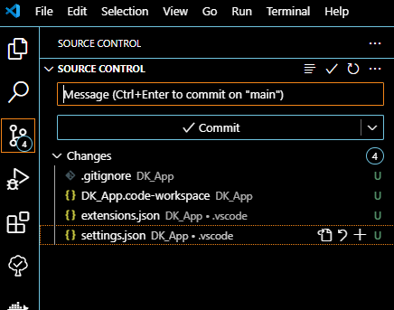

# Project Structure

Now that we have some of our general tools installed we can begin setting up the projects main directory, set up git, and make our first commit.

### Making the Project Directory

There are two ways to make the initial folder.

- Create a folder on your computer and use git init
- Create a project on GitHub, or platform or choice, and clone the repository.

I will be doing the second, but the first will work fine, you just skip any steps pertaining to GitHub.


#### Create the GitHub Project

- Create the name for your project.  Mine will be `DK_App` so any time I use `DK_App` you will likely need to use your own projects name.
- Add a description
- Set Public or Private
- Add the README
- Add the license.   I am using the "AGPL-3.0 license" and if you are directly following this tutorial to copy its code you will also need to include this license in you project.
- Create

#### Clone the GitHub Project

I will be using ssh for communication with GitHub.  A tutorial for setting that up for windows can be found [here](https://www.theserverside.com/blog/Coffee-Talk-Java-News-Stories-and-Opinions/GitHub-SSH-Windows-Example).

Once you have you ssh key set up you can clone the project.

With git install for windows I can right click where I would like the project file to live and pick "Open Git Bash here"

Copy the ssh url from GitHub by clicking the green "clone" button and picking ssh.

then in the git bash shell run:

```
git clone <PASTE URL>
```

for window crtl+v and crtl+shift+v both did not work and I had to right click paste the url.

It will then ask you to add GitHub's fingerprint to your list of known hosts.


If you are not using a platform like GitHub instead create a folder with the name of your project then:

- run `git init` from the git bash shell in that folder
- add an empty README.md file
- add the license file


### Open in VS Code

You can right click the folder and select "Open with VS Code" or open VS Code and use "Open Folder as Project"

Now you can use VS Code to edit the README file and add a description of the project.  This is where you can eventually add the instructions to install and setup, and various links to documentation, tutorials, or socials.  This file uses [markdown](https://www.markdownguide.org/) for its formatting

We also want to add a `.gitignore` file.  This is what we will use to exclude files from being tracked by git.  This is to ignore files the builds, caches, or files holding sensitive data like private keys. 

We also need to make the workspace folder for the next part of the project, the python server.  I called this folder `dk_server_ws` 

We also make a `.vscode` directory, that we can put settings and extension files in.  Any setting you add here will be applied to all projects in this git repository.  I am not going to add any here and will be adding settings based on the individual projects.

We will make an `extensions.json` file in the `.vscode` directory.  This is where we can list VSCode extension that this project uses.  This is the list of recommendations I had in the setup.

```
{
	"recommendations": [
		"mechatroner.rainbow-csv",
		"aaron-bond.better-comments",
		"Gruntfuggly.todo-tree",
		"seunlanlege.action-buttons",
		"usernamehw.errorlens",
		"tamasfe.even-better-toml",
		"fill-labs.dependi",
	]
}
```

Now when you or anyone cloning your project should see these extensions in their recommendations in VS Code.

### Workspaces

Workspaces allow you effectively open multiple vs code projects at the same time under a single VSCode explorer.  The workspace folders do not have to be in the same parent folder, but in this case they will be.  More details on workspaces [link](https://code.visualstudio.com/docs/editor/workspaces/workspaces).

We can add a workspace for the server project by right clicking in the explorer and choosing "add folder to workspace" then picking the `dk_server_ws` directory.

We then want to save the workspace to a file in the main projects directory using "save workspace as" in the "file" menu.  When we reopen VSCode to work on the project we will want to use "open workspace from file" and open this file.

### Directory Overview

```
DK_App
|_ .vscode
|  |_ extensions.json
|  |_ settings.json
|_ dk_server_ws
|_ .gitignore
|_ DK_App.code-workspace
|_ LICENSE
|_ README.md
```

Appendix [Project Directory Structure](./../Appendix/Project%20Directory%20Structure.md)

### Commit and push

Now we can create a commit (project version save) and push it to our remote repository.



I will mostly use the UI for this (for now at least).

- Click source control on the left.
- Add a message for the commit that describes the changes:
	- "Updated the readme, and created the workspace for the folder"
- Hit "commit", it will then ask if you want to stage the changes, you do.
- If it has an error about name and email you need to use git config [Git Trouble Shoot](./../Appendix/Git%20Ignores.md).
- Then you can hit "sync" to push to GitHub.

We now have our initial parent project set up and can move to starting on the server project.

#### Extra: Command Line git

```
git add .

git commit -m "Updated the readme, and created the workspace for the folder"

git push
```

This is the equivalent command for the UI process. [Git Cheat Sheet](./../Appendix/Git%20Cheat%20Sheet.md)
