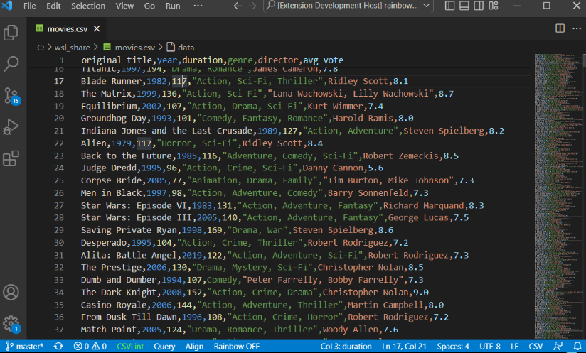
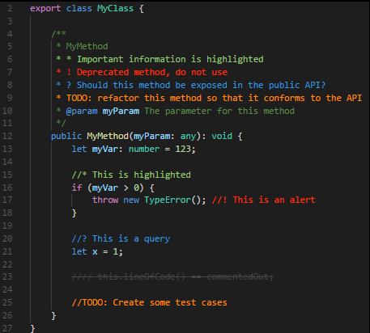

# VS Code Setup

VS Code is our IDE of choice for this project.  It is pretty lightweight and can be configured with plugins to work with nearly any project or programing language.

### Install

VS Code can be found here:   
https://code.visualstudio.com/docs/setup/setup-overview

It is available for Windows, Linux, and Mac.

### Setup

#### Config

VS Code's setting can be configured through its UI or by editing the json file.  I have preferred to use the json file as it is easier to copy paste multiple settings.  You should be able to use the search bar of the setting's UI to change each of the settings in the UI if you decided not to go with the json file. 

VS Code has different layers of settings.  It has global or profile settings that apply to the whole editor, or profile and folder settings that can overwrite the global settings in a specific directory.

Note that the `settings.json` file should be a pair of `{}` and each setting should be separated by commas.  

Hovering over a setting in the json file should have VS Code pull up a short description of the setting.

These are some of the main settings that I set for my editor:  

```
// Workbench settings
"workbench.settings.editor": "json",
"workbench.tree.indent": 16,
"workbench.colorTheme": "Default High Contrast",
```

- `editor` is how you choose if you want the settings button to open the UI or the json file.  

- `indent` is how many pixels you want indentions to be in the file explorer.  

- `colorTeme` is the theme for VS Code a list of which can be found [here](https://vscodethemes.com/)  


```
// Explorer Settings
"explorer.autoReveal": true,
"explorer.confirmDragAndDrop": false,
```

- `autoReveal` will cause the file explorer to expand directories and highlight the file you are actively working on.  Some preferer to turn this off and use something like [locate this document](https://marketplace.visualstudio.com/items?itemName=SmarterTomato.locate-this-document) instead.  

- `confirmDragAndDrop` will ask for confirmation any time you drag and drop files, moving them around the project directory.

```
// Editor setings
"files.autoSave": "onFocusChange",
"editor.insertSpaces": false,
"editor.cursorStyle": "block",
```

- `autoSave` in this mode files will be saved as soon as you click off of them.  This can sometimes be annoying though when combined with formatting on save, but I prefer it over trying to figure out why my changes are not working only to find out I haven't saved changes to three of the files I was editing ten minutes ago.
- `insertSpaces` with this false tab will do what it is supposed to do and insert a tab.  I use keyboard to navigate to cursor pretty often while working and use shift + arrow keys to select text and I hate having to click through each of the spaces that get added in for indentions and much prefer tabs.
- `cursorStyle` is just choosing a character width block like command lines often have, or a bar the sits between characters like most modern applications.

There is plenty of other settings to explore if you want to further customize.  I will cover the setting some more when I am explaining setting up the folder level setting for the different parts of the project.  

Appendix [VS Code Configs](./../Appendix/VS%20Code%20Configs.md)

#### Extensions

This is a list of general extensions that I recommend for VS Code.  Most extensions have their own settings that can be added to your global or folder settings files.

##### General

***Rainbow CSB:***

`mechatroner.rainbow-csv`  

This one has many features for editing and searching csv (comma separated values) files.  The main feature is that it colors the text of different  columns of the cvs the same colors to better see what each of the values in a row match to each of the.  It also has tools for SQL like queries on the csv files and and more.



***Better Comments***

`aaron-bond.better-comments`

This adds a few options to mark code comments as specific types of messages.



***Todo Tree***

`Gruntfuggly.todo-tree`

This highlights comments that start with TODO 

```
# TODO Fix
// TODO Fix
```

and creates a file directory like tree of them that can be accessed on the side bar.  This is useful to mark function templates that need to be implemented, or debugging code to be removed.

For the debug marker, `DEBUG` would need to be added to the settings file:

```
"todo-tree.general.tags": [
	"BUG",
	"HACK",
	"FIXME",
	"TODO",
	"XXX",
	"DEBUG",
	"[ ]",
	"[x]"
],
```

There are plenty of other settings for it and you add or change the tags to what ever you prefer.

***VsCode Action Buttons***

`seunlanlege.action-buttons`

This allows you to add customized buttons to the bottom of the workspace used to quickly run commands.  This is useful when commands to build, run, debug or other tasks require longer commands and you want a quick way to repeat those commands.  

This is an example of a button to run pytest with options:

```
// Action Buttons
"actionButtons": {
	"commands": [
		{
			"name": "pytest",
			"color": "yellow",
			"command": "uv run pytest -v -rP"
		}
	],
	"defaultColor": "white",
	"reloadButton": "↻",
	"loadNpmCommands": false
},
```

***Error Lens***

`usernamehw.errorlens`

This just adds more aggressive highlighting of errors with plenty of settings to customize it.

***Even Better TOML***

`tamasfe.even-better-toml`

This adds formatting and checking of toml files, which will be useful for this project.

***Dependi***

`fill-labs.dependi`

This can check dependencies for a few different languages like Go, Rust, Python, others.  This will help make sure the the dependencies we are using are up-to-date or don't have known vulnerabilities. 

A full list of extensions I use can be found in 
